# Project 1: Design Journey

**For each milestone, complete only the sections that are labeled with that milestone.**

Be clear and concise in your writing. Bullets points are encouraged.

**Everything, including images, must be visible in Markdown Preview.** If it's not visible in Markdown Preview, then we won't grade it. We won't give you partial credit either. This is your warning.

## Markdown Instructions

This is a Markdown file. All written documents that you will submit this semester will be Markdown files. Markdown is a commonly used format by developers and bloggers. It's something that you should know. Learning it is a learning outcome of this course.

The following links are Markdown references:
- <https://guides.github.com/features/mastering-markdown/>
- <https://github.com/adam-p/markdown-here/wiki/Markdown-Cheatsheet>

When writing your Markdown file in Atom. Open the command palette and search for **Markdown Preview Plus: Toggle**. This will open up a panel in Atom where you can preview your formatted Markdown file. **The graders will grade you submission in Markdown Preview. All images must be visible in Markdown Preview.**

This is how your insert images into your Markdown documents:

**DELETE THIS SECTION (and example.png) BEFORE THE FINAL SUBMISSION.**

## Audience & Content

**Make the case for your decisions using concepts from class, as well as other design principles, theories, examples, and cases from outside of class.**

You can use bullet points and lists, or full paragraphs, or a combo, whichever is appropriate. The writing should be solid draft quality but doesn't have to be fancy.

**No sketches are required for Milestone 1.**

### Website Topic (Milestone 1)
> Briefly explain what your website will be about.

This is a general personal website, showing people who I am, what I love, and any other facts that could help people learn more about me.

### Audience (Milestone 1)
> Briefly explain who the intended audience(s) is for your website. Be specific and justify why this audience is appropriate for your site's topic.

The target audiences of my website are my new friends who are interested in me. I make friends in workplaces, in theaters, on some forums, and in any other place. But all they know is just one fraction of me. They may know that I am a man of responsibility or a guy with a deep affection for movies. The thing they don't know, and want to know is a whole picture of me. This site’s topic happens to be my general web presence, which could meet my new friends' needs.

### Final Content (Milestone 1)
> Briefly describe the content you plan to include in the final site, and why it's the right content for your audiences.

The final site will include,
* My general information
* My background information
* My hobbies
* My social media accounts

My viewers’ motivation to explore this site is to learn more about me and decide whether they should strengthen our relationship or not based on this observation. To me, the rational approach to start to know someone is first reading his profile, knowing his physical and social identity; then, collecting background information, especially educational background, so that I know his capabilities; after that, I would like to check his hobbies, wondering if we have anything in common. Checking his abilities is to determine whether he would be helpful to me; checking his hobbies determines whether he could bring me joy. Based on these observations, if I still want to strengthen our relationship, I would love to have his contact information, especially social media accounts. That's why I will also put my contact information in the site.

### Home Page Content (Milestone 1)
> Briefly identify what content you will include on the homepage and why this content should be the first thing your target audience sees when they visit your site.

The homepage will only include the navigation panel. Because I want the content of this site to be well-organized, each module has its page. If I put any of these modules on the homepage, it will ruin the whole site’s equilibrium. Thus, the first thing my audience sees should be the navigation panel, which could lead them to the content they are looking for.

## Information Architecture

**Make the case for your decisions using concepts from class, as well as other design principles, theories, examples, and cases from outside of class.**

Each section is probably around 1 reasonably sized paragraph (2-4 sentences).

**No sketches are required for Milestone 2.**

### Audience (Milestone 2)
> A clearer description of audience: who are they, what are they interested in with respect to this site, and what are the design goals for that audience.

1. Target Audience
> The target audience of this website are my new friends from forums, school, workplace, or even the subway stations. They do not know me well, but they respect me for some aspects and willing to find out more about my life and other sides of me.

2. What are they interested in with respect to this site?
> Their purpose is to get to know their new friend(which is me). They come here seeking information about my life, hobbies, career and any other aspects of me. To be more specific, aspects like hobby, career and educational background would probably be their main concerns.

3. What are the design goals for that audience?
> The most important design goal is to give my audiences what they want as clearly as possible. On the content level, each paragraph needs to be well-structured and informatic; on the site level, I need a strong navigation system to guide people to the content they are looking for. Also, since the audiences are friends to me, it is equally important to create a friendly atmosphere thoughout the site.

### Organization & Navigation (Milestone 2)
> A description of how you generated and considered alternatives for the site's content organization and navigation. You are required to include images here of your card sorting for determining the organization of content and the navigation.

> Thoroughly document this process. The _process_ is the important part of this assignment, not the final result.]

As is mentioned in the previous modules, the most important contents this site should have are my general information, my interests and my skill tree. With this in mind, I asked myself, if I am the "new friend" of Hangyu, what specific contents would I want to know about him in these three particular areas? These are things come to my mind.
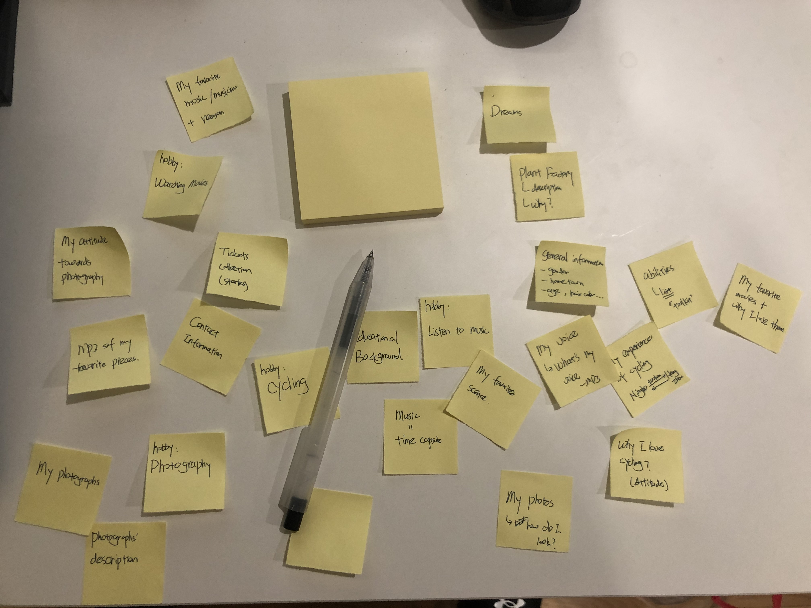
Then, I made the most rational decision- sorting these cards into those three areas, which is the Profile, the Hobbies, and the Career. In each area(aka class), I separated contents into several subgroups. Each subgroup represents a single webpage.
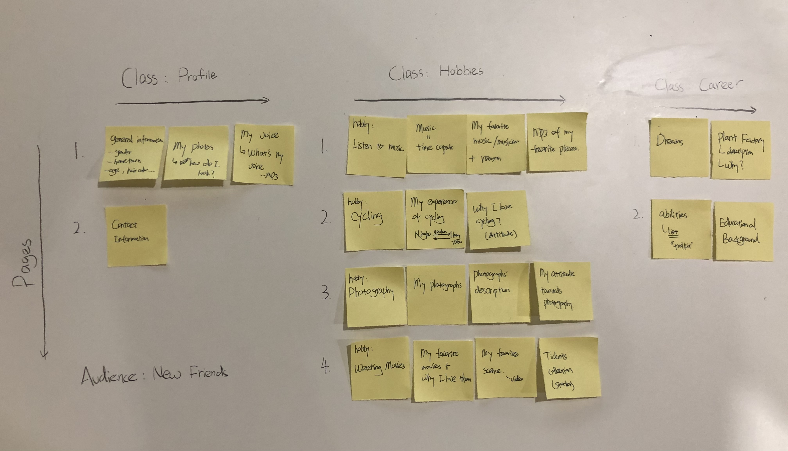
The image above is the original organization. All subgroups have been labeled with numbers. Notice that there is no "homepage" in this arrangement. This is a mistake. But luckily, there is no extra content in the homepage. The homepage is designed to be a navigation platform, which will only contain the navigation bar.

I also considered several alternatives.
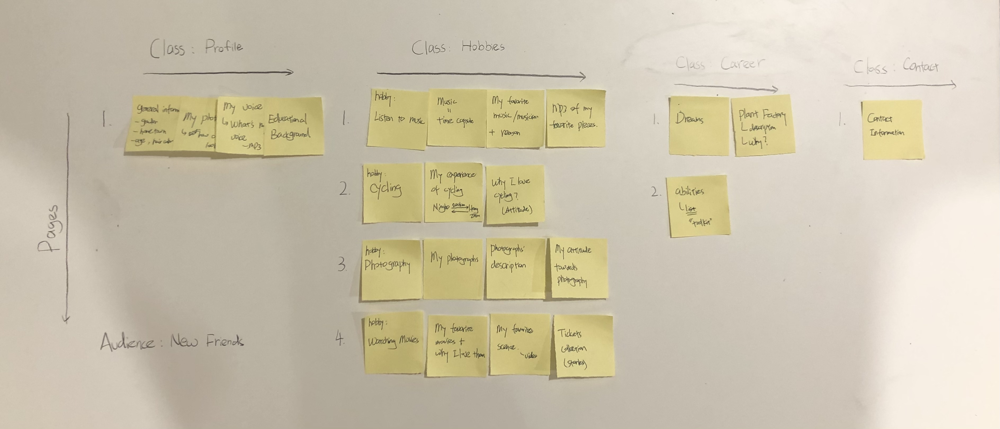
I considered to move the educational background module to the profile class, letting contact information module alone to be a new class called "Contact". There is no change in the total number of webpages, it's just a subtle adjustment on the content allocation.

Besides, I also considered to merge some pages so that each one of them would be more informatic.
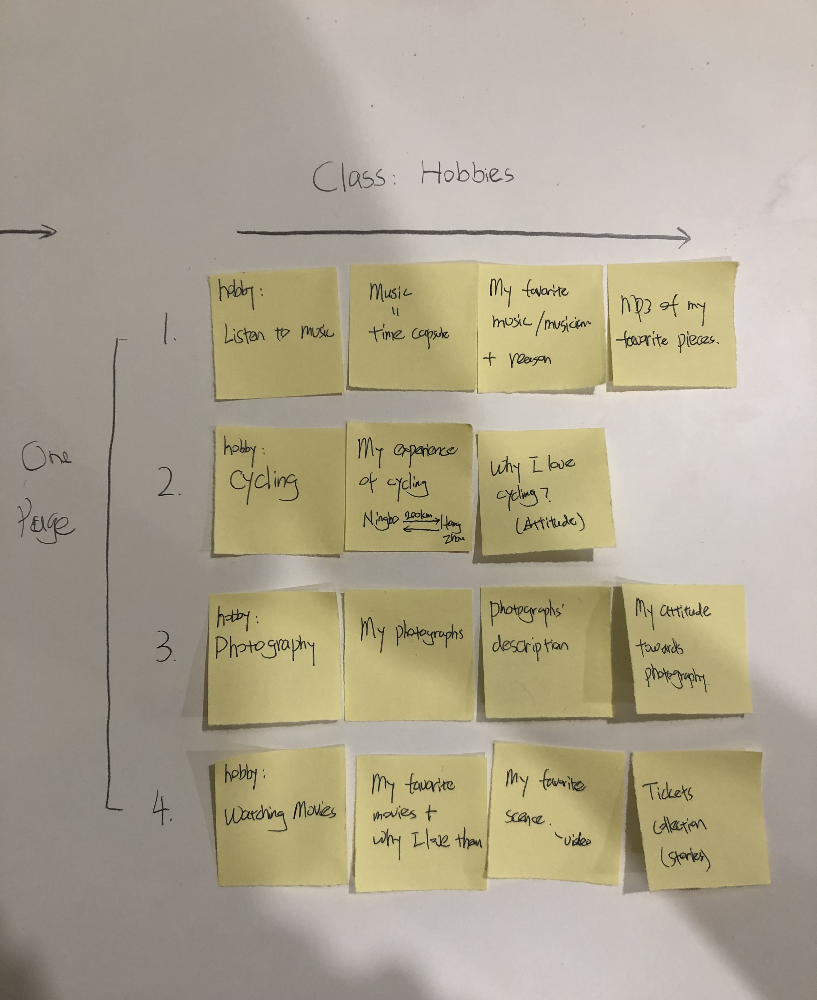
I considered to combine all hobbies pages into one page called "Hobbies". Applying same adjustment into the other two classes, we obtain another alternative of content arrangement.
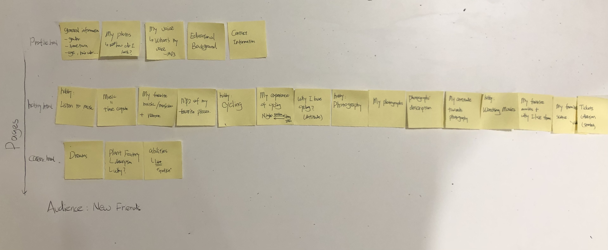
Although this organization could sharply decrease the total number of webpages, it also makes pages quite lengthy. The hobby page is especially cumbersome.

### Final Organization and Navigation (Milestone 2)
> Explain how the final organization of content and navigation is appropriate for your target audiences.

Among all these alternatives, I eventually chosed this one below to be the final organization.

First of all, this arrangement is built on my target audiences' needs. Webpages are divided into three different classes, presenting my general information, hobbies and skill tree to my new friends.

Secondly, this organization is more user-friendly then the other two choices. The whole site consists of eight short sheets with focused subtopics. Users could easily tell from the navigation panel what contents the site is offering and where they should click to find the resources they are looking for.

Thirdly, it may not be true, but I believe webpages with limited amount of contents are more readable and "friendly" than those lengthy pages. Reading a long page could be quite stressful (at least for me...) In this sense, the final organization, which contains 8 lightweight pages, could potentially make the whole precess less stressful and more user-friendly.

## Visual Design

**Make the case for your decisions using concepts from class, as well as other design principles, theories, examples, and cases from outside of class.**

Remember to focus on the things we can't see just by looking at the site: changes, alternatives considered, processes, and justifications.

Each section is probably around 1 reasonably sized paragraph (2-4 sentences).

### Theme Ideas (Milestone 3)
> Discuss several ideas about styling your site's theme. Explain why the theme ideas are appropriate for your target audiences. Feel free to include some hand-drawn sketches (not digital drawings, not mock-ups, not wireframes, etc.) here to document your design process.

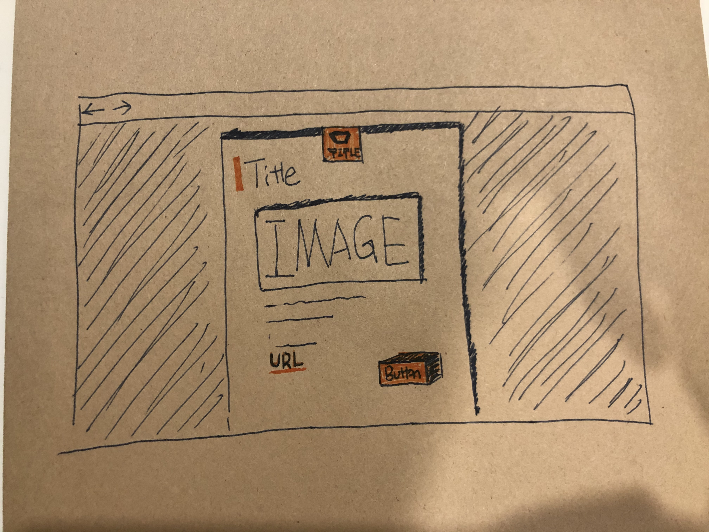
The first one that comes to my mind is Minimalism. The picture above is the hand-drawn sketch of this theme. I believe neatness is crucial for the readability of webpages. And I think minimalism could also leave my audiences, new friends of mine, a positive impression that I am a man with strong executive power.
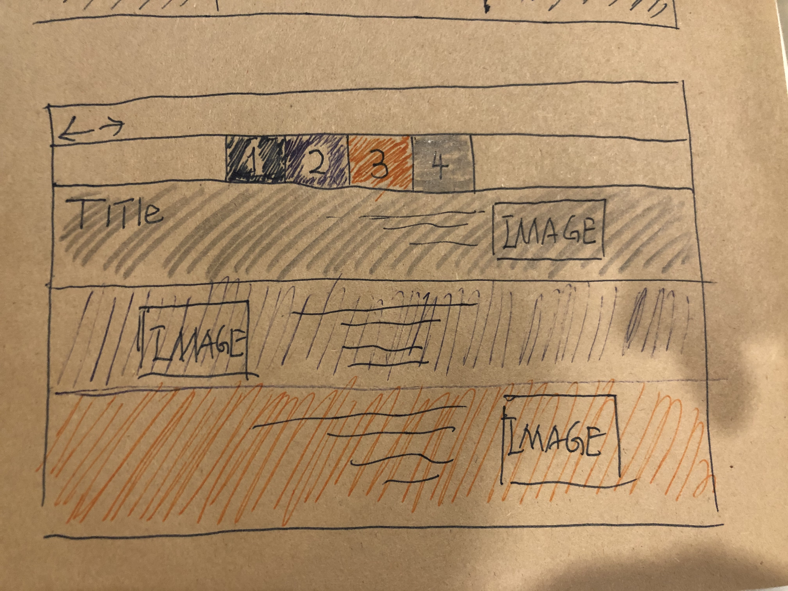
The alternative plan is more enthusiastic and colorful, making people believe that I am an energetic young man.

Also, considering my audience’s nature, a theme that could create a friendly atmosphere is a great choice. I will use warm colors and round font to reach that goal.

### Theme Design (Milestone 3)
> Discuss your theme designs: how did you come to them, what are their strengths and weaknesses, how do they fit your overall design goals and audiences?

> Emotion is a big part of design. What emotions where you thinking about or trying to convey in your designs?

From the three themes mentioned above, I chose two of them to be the two alternatives to my site’s theme.

My design principle for this site is that -- design the theme based on the impression of me I want to give to my viewers. This personal website is an online version of me; whatever image the website provides to my audiences is their impression of me. Thus, I asked myself what kind of person I want to be in my friends’ eyes?

The first choice is to make them believe that I am a man with strong executive power. To achieve this, I came up with my first theme -- minimalism.

The picture above is a demo of this theme. Each page will have a distinctive theme color in practice, which will show up on elements like hypertexts and buttons, decorating the page with bright spots. Other parts of the pages will be white for cleanness, and the font and content alignment will also be designed for the goal of neatness. The underlying theory is that minimalism means neatness and precision; it means focusing on things of significance, which is exactly what a man with strong executive power would do when tackling problems. The bright spots represent the energetic attitude towards missions.

The great advantage of this theme is that the readability is guaranteed. However, the theme could also be too dull -- viewers could be bored. I will cope with this problem by adding more interactive features to the site.

The second choice is to emphasize the energetic nature of me as a young man.

To achieve this, I use colorful bulks to construct pages. Because bulk means power, bright color means energy and creativity. Combining these two could create the chemical I need to leave people with the impression that I am an energetic young man. Also, the font size will be bigger than the first theme; elements will be closer to each other.

But it’s challenging to maintain the readability while using all kinds of bright colors throughout the site.

## Rationale

**This rationale should be polished writing: one you might submit as a report to a client or boss to help explain the project and convince them you did a good job. You'll be surprised how much writing and communicating you need to do about projects and choices on internships and jobs; practice that here.**

It should be a comprehensive, complete story of the project. You might find that each section runs a few paragraphs (1-2). Sketches can often help tell the story of your design. Screenshots are also useful for describing issues discovered during the design process and how you addressed them.

**All images must be visible in Markdown Preview for credit!**

Your rationale should be a polished version of the earlier explanations.

### Site Layout (Final Submission)
> Show your design process and final layout for your site. You must include photos of your sketches of the layout. No digital drawings permitted.

> You must label each figure and provide an explanation of the sketch.

Before I started the design journey of this project, I spent a lot of time surfing the Internet, found some really interesting web designs.
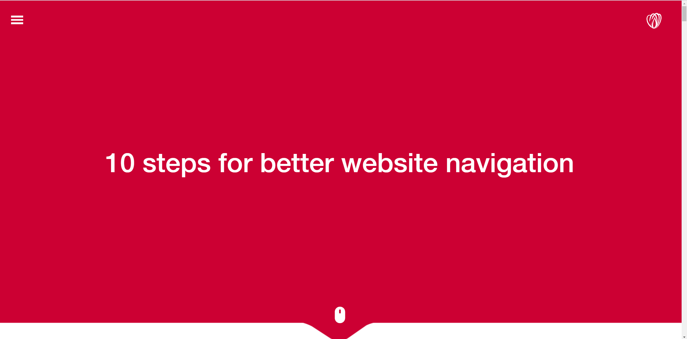
This is a company focuses on web design. I was attracted by this visual design at the first glance.

The link is:https://www.butterfly.com.au/blog/design/10-steps-for-better-website-navigation
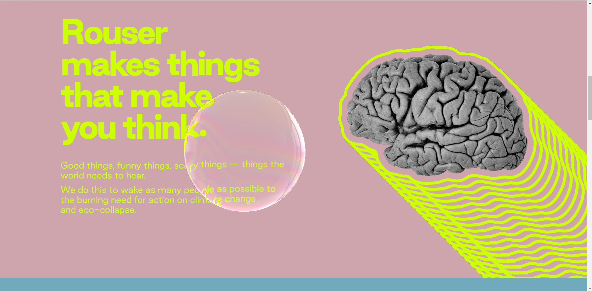
The image above is another amazing website I found. The elements are really interesting, and the layout has great user experience.

You could check out at here:https://www.rouserlab.com/about/

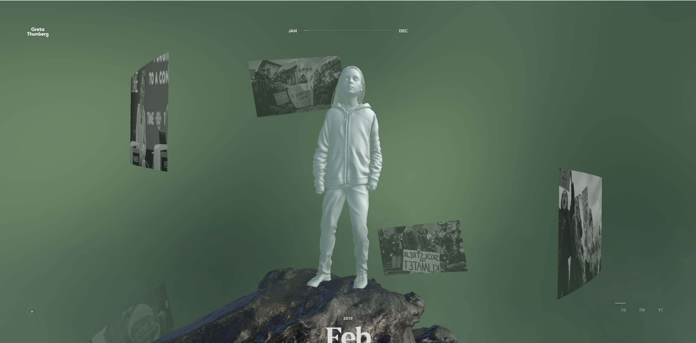
This is another outstanding website. It gives people a very different but fluent experience. People could scroll and check out different videos about Greta.

The link is:https://theyearofgreta.com/

After experienced very different webpages, I realized the possibility of web layout. So, I came up with an idea - I turn my whole site into an archive.

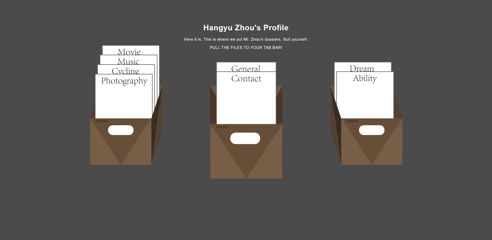
This is the main page of my website. I sorted and placed different webpages into three different boxes. Viewers could drag a page to their brower's tab bar and check out every single webpage.
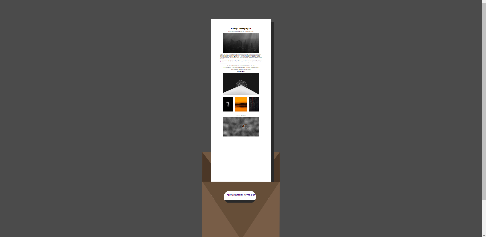
Every pages has the same layout. First is the centralized contents, then is the footer which could help users return to the main page to select another webpage.
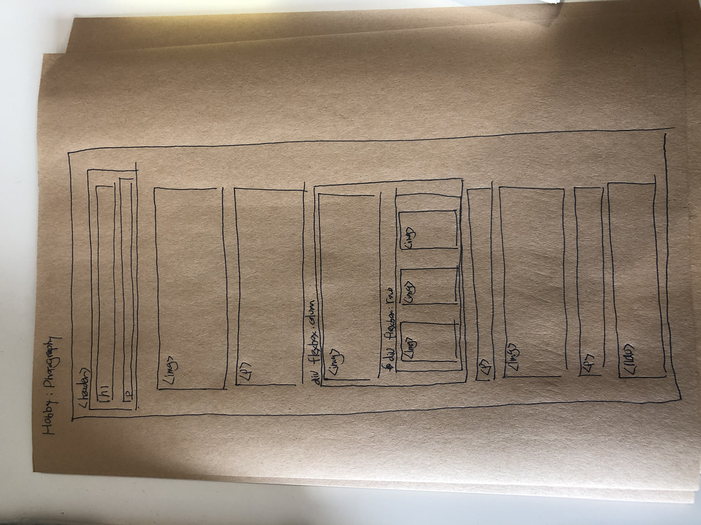
The image above is an example of my sketches of webpages. I use this useful technique to arrange everything in my website.

### Audience (Final Submission)
> A complete and polished description of the intended audience(s) for your website.

The target audiences are people who is not familiar with me, but for some reason, willing to know more about me. The most classical example is my new friends.

### Design Goals (Final Submission)
> An explanation of the design goals for that audience, based on your earlier rationales.

The most important design goal is to give my audiences what they want as clearly as possible. On the content level, each paragraph needs to be well-structured and informatic; on the site level, I need a strong navigation system to guide people to the content they are looking for. Also, since the audiences are friends to me, it is equally important to create a friendly atmosphere thoughout the site.

### Navigation (Final Submission)
> An explanation of how the final navigation met your goals and why its appropriate for your audience(s).

The final navigation is "homepage oriented". Each page creates a single connection with homepage, which serves as a navigation panel. The homepage is designed to give user a great experience, both on the content level, and on the visual design perspective.

Since my site consists of nine lightweight pages, traditional robust navigation system would seems to be redundant. My final navigation system is straight forward and easy to use.

Also, in order to create a navigation system which looks like an archive, I have no choice but to get rid of the traditional navigation bar syntax in html. 

### Organization (Final Submission)
> An explanation of how the final organization met your goals and why its appropriate for your audience(s).

First of all, this arrangement is built on my target audiences' needs. Webpages are divided into three different classes, presenting my general information, hobbies and skill tree to my new friends.

Secondly, this organization is more user-friendly then the other two choices. The whole site consists of eight short sheets with focused subtopics. Users could easily tell from the navigation panel what contents the site is offering and where they should click to find the resources they are looking for.

Thirdly, it may not be true, but I believe webpages with limited amount of contents are more readable and "friendly" than those lengthy pages. Reading a long page could be quite stressful (at least for me...) In this sense, the final organization, which contains 8 lightweight pages, could potentially make the whole precess less stressful and more user-friendly.

### Visual Design (Final Submission)
> An explanation of how the final design met your goals and why its appropriate for your audience(s).

This site is a personal online presence for me. So the impression the website gives to my audiences is their impression of me. Thus, the decision of the visual design theme resides on what kind of impression I want to form in my friend’s mind.

I choose to make them believe that I am a man with strong executive power. Thus, I choose minimalism to be the visual theme.

The picture above is a demo of this theme. Each page will have a distinctive theme color in practice, which will show up on elements like hypertexts and buttons, decorating the page with bright spots. Other parts of the pages will be white for cleanness, and the font and content alignment will also be designed for the goal of neatness. The underlying theory is that minimalism means neatness and precision; it means focusing on things of significance, which is exactly what a man with strong executive power would do when tackling problems. The bright spots represent the energetic attitude towards missions.

The great advantage of this theme is that the readability is guaranteed. However, due to time limitation, I have not add bright-colored decoration and many three dimensional features. But the overall experience is acceptable.

### Self-Reflection (Final Submission)
> What did you learn from this assignment? What are some of your strengths and weaknesses?

While I was struggling to finish this prolonged assignment, I learned a lot of techniques for CSS and HTML, as well as the basic principles of visual and user-oriented design. To conclude, the biggest weakness of me is Procrastination. I always started too late to finish tasks. Due to this, I did not receive the feedback of milestone2, and then subsequently did not realize my topic was a bit out of the scope. So I have to reconstruct the whole site within the last few days. Although the website is basically well-functioned, there is still a lot of work to do for a great user experience.

For the strength, I think I have a good grasp of aesthetics, which helped me a lot in the visual design process. Besides, I am energetic, willing to devote time to things I love. Or the site could never be built in the way it is.
